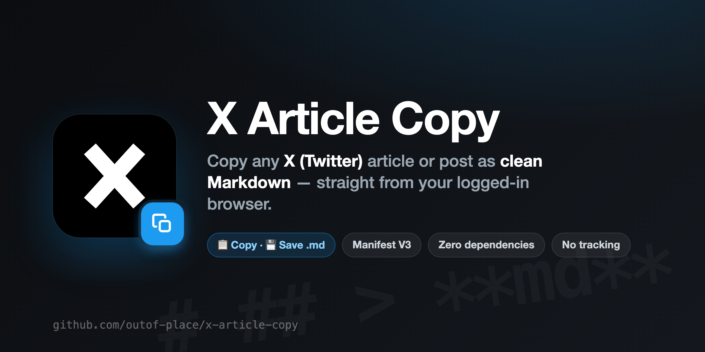

<div align="center">



**Copy any X (Twitter) article or post to your clipboard — or save it as a `.md` file — in clean Markdown.**

Reads the page from your logged-in session, so it works behind the login wall. No servers, no tracking, no dependencies.


</div>

---

## ✨ What it does

You're reading an X article you want to keep. Copy-pasting usually gets you a soup of UI text, "Subscribe to Premium" footers, and broken formatting. This grabs the **actual content** instead.

- 📋 **One-click copy** — floating button on the page, content lands in your clipboard as Markdown
- 🖼️ **Popup with preview** — see and **edit** the Markdown before you take it
- 💾 **Save to file** — export a `.md` named after the article title
- 🧹 **Strips the cruft** — removes X chrome: like/repost buttons, avatars, the "Subscribe to Premium" footer, post timestamp, view count, "View quotes" (PL + EN)
- 🔒 **Private by design** — everything happens locally in your browser. Nothing is sent anywhere.
- 🪶 **No dependencies** — plain JS, ~12 KB. No build step, no tracking, no analytics.

## 🎬 Demo

<div align="center">


_Open an X article → the popup shows the clean Markdown → copy or save._

</div>

<details>
<summary><b>Record your own in ~2 minutes (macOS)</b></summary>

1. Open an X article while logged in.
2. Press **⌘⇧5** → record a selected region. Capture: open the popup → click **Copy** → click **Save .md** (~6–8 s). Save the `.mov`.
3. Convert to an optimized GIF with ffmpeg:
   ```bash
   ffmpeg -i demo.mov -vf "fps=12,scale=900:-1:flags=lanczos,split[s0][s1];[s0]palettegen[p];[s1][p]paletteuse" -loop 0 docs/demo.gif
   ```
4. Save it as `docs/demo.gif` and uncomment the `` line above.

</details>

## 📥 Install

Not on the Chrome Web Store — load it unpacked (30 seconds):

1. Download / clone this repo
2. Open `chrome://extensions`
3. Toggle **Developer mode** (top-right)
4. Click **Load unpacked** and pick the project folder
5. (optional) Pin the extension to your toolbar

> Works in Chrome, Brave, Edge and other Chromium browsers.

## 🚀 Usage

On any article or post on `x.com` (while logged in):

**Popup (recommended)** — click the toolbar icon:
- preview the Markdown, edit it if you want
- **📋 Copy** → clipboard
- **💾 Save .md** → downloads a file

**Quick button** — the floating **📋** in the bottom-right: one click = copied.

## 🧠 How it works

A content script walks the article's DOM and converts it to Markdown:

| Captured | Stripped |
|---|---|
| Title, source link | Reply / like / repost buttons |
| Headings, paragraphs, lists | Avatars, SVG icons |
| Blockquotes, code blocks | "Subscribe to Premium" footer |
| Images (``) + captions | Post date, view count, "View quotes" |
| Links (resolved to absolute URLs) | Code-language labels above fences |

No API calls — it just reads what your browser already rendered.

## 🛠️ Tuning

If X changes its DOM and something breaks, it's almost always one of these in `content.js`:

- `findRoot()` — picks the content container (default: `[data-testid="primaryColumn"]` → largest `<article>`)
- `SKIP_TESTIDS` / `SKIP_TAGS` — UI elements to drop
- `JUNK_LINE` — line patterns to remove (footer, date, views…)

Redraw the icon with `node generate-icons.js`, or the social banner from `docs/banner.html` (both pure Node / HTML, no deps).

## 🌍 Note on language

The UI strings are currently in **Polish**. i18n PRs very welcome — strings live in `popup.html`, `popup.js` and `content.js`.

## 🤝 Contributing

Issues and PRs welcome. It's a tiny, single-purpose tool — keep it dependency-free and fast.

## ⚖️ Disclaimer

Unofficial. Not affiliated with, endorsed by, or connected to X Corp. "X" and "Twitter" are trademarks of their respective owners. This tool is for **personal use** — copying content you can already see while logged in, for your own notes. Respect copyright and X's Terms of Service; don't republish other people's work without permission.

## 📄 License

[MIT](LICENSE)
